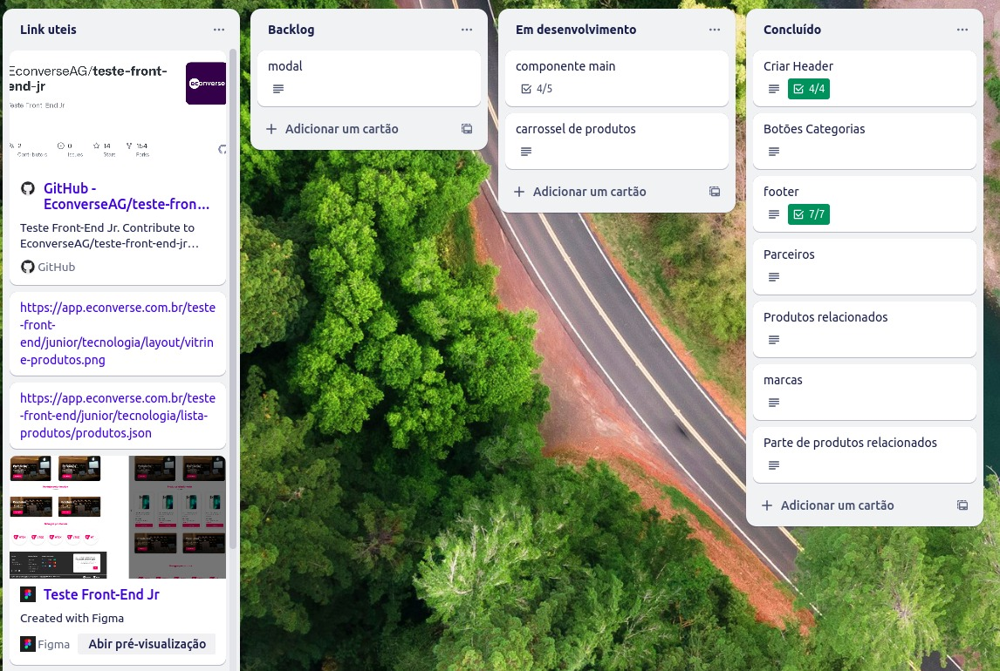

# Teste Econverse: Vaga Desenvolvedor Front-End Jr

Este é um projeto desenvolvido para o teste da Vaga Desenvolvedor Front-End Jr da Econverse.

#### Especificações Técnicas
- Desenvolver a pagina em React e TypeScript conforme o [layout](https://www.figma.com/file/rWnzPeoxgynuNPsJjV0VmV/Teste-Front-End-Jr?node-id=0%3A1). 
- Montar a [vitrine](https://app.econverse.com.br/teste-front-end/junior/tecnologia/layout/vitrine-produtos.png) de produtos consumindo as informações dos produtos em json atraves desse [Link](https://app.econverse.com.br/teste-front-end/junior/tecnologia/lista-produtos/produtos.json).
- Desenvolver a interação ao clicar em um produto conforme layout. A interação consiste em abrir um modal com as principais informações do produto presente no arquivo [JSON](https://app.econverse.com.br/teste-front-end/junior/tecnologia/lista-produtos/produtos.json) conforme o produto que clicar.
- Utilizar Pré-processador Sass, Less ou Stylus.
- Respeitar o Layout pixel a pixel, tamanho das fontes, cores e botões.
- Não Utilizar bibliotecas UI como Bootstrap, Foundation, ou afins.

#### Pontos Extras
- Utilizar Boas práticas de SEO
- Uso de HTML semântico

## Organização do projeto:
Para manter uma organização eficiente durante o desenvolvimento, recorri à ferramenta Trello. Utilizei-a para mapear minhas tarefas, identificar pendências e detalhar os componentes necessários, garantindo uma visão abrangente do progresso do projeto.

    

 

## 🚀 Começando

Essas instruções permitirão que você consiga ter esse projeto em operação na sua máquina local para fins de desenvolvimento e teste.

### 📋 Pré-requisitos para instalação 🔧

* Clone o repositório [teste-front-end-jr](https://github.com/SahBianchi/teste-front-end-jr)
* Entre na pasta do projeto e instale via terminal utilizando o comando: npm install.
* Após a instalação ainda no terminal digite o comando: npm start 
 
 

## Agradecimento
Quero expressar minha sincera gratidão pela oportunidade de participar deste teste. Foi um desafio estimulante e enriquecedor. A estética do layout é excepcional, e fiz o possível para respeitar todos os detalhes com cuidado e atenção.
 

Reconheço que há áreas no código que podem ser aprimoradas e refatoradas, mas dediquei meu melhor esforço dentro do prazo estipulado. Espero que apreciem o resultado final tanto quanto eu apreciei o processo de criação.